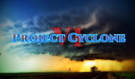

# ProjectCycloneV1-FiveM

# ProjectCyclone V1 Beta Release

 

This is a server side Ambaince sound overhaul
that changes the default GTA weather sounds

The current sounds

-Rain
-3 Different thunder sound

More comming in the next update 

# INSTALL

Drag The ProjectCycloneV1-FiveM in to youre resource folder

Add ensure ProjectCycloneV1-FiveM to youre server config
and start/restart the server

if there are anny problem open a issue on this github
or
contect me on the following email
info@vrfusion-entertainment.com
